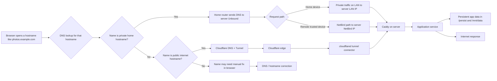
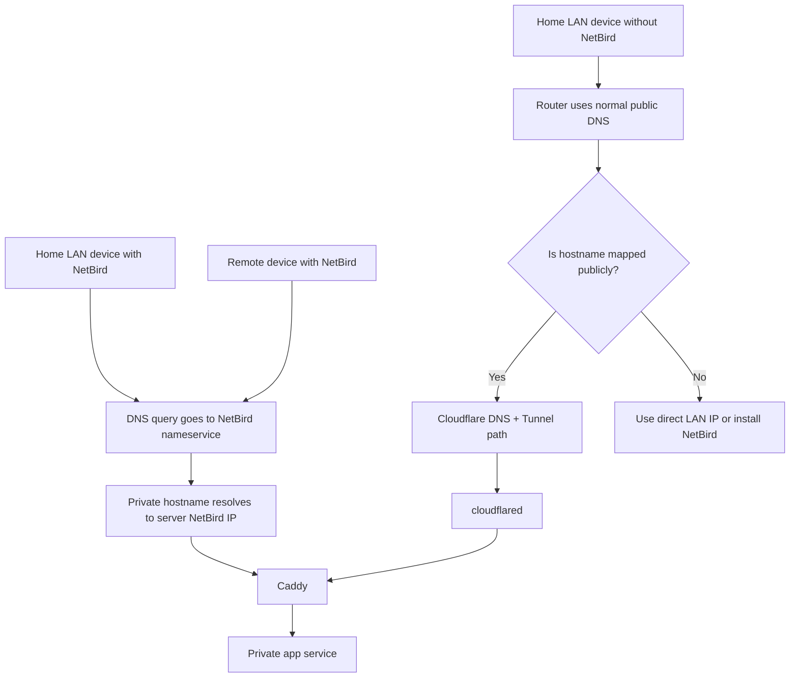

# NixHomeServer

NixHomeServer is a reproducible NixOS home-server configuration for people who
want to run more of their digital life at home: photos, files, documents,
passwords, media, backups, and private app access.

The first install is the only time this repository expects destructive disk
work. After the server exists, routine administration moves to
[`documentation/operations.md`](./documentation/operations.md), the server
homepage "For Admins" page, and the other guides under
[`documentation/`](./documentation).

## Stage 1: Decide If This Is The Right Project

This project is for someone who wants a private home server rather than a set of
cloud accounts. It can replace or reduce dependence on services like Dropbox,
Google Photos, iCloud Photos, Netflix-style media libraries, document storage,
and hosted password managers.

It is not a magic appliance. You will still need:

- A physical machine that stays on at home.
- Disks for the operating system and data.
- A home network that can reliably reach the server.
- A domain name if you want friendly app names and public sharing.
- A few external accounts for routing, certificates, remote access, alerts, or
  offsite backup.
- Enough patience to treat the first install like setting up household
  infrastructure, not like installing a phone app.

The repository gives you the repeatable plan. NixOS builds the operating system
from this repo. The deploy helper tests changes before making them permanent.
Secrets are encrypted before they are committed. Storage is split between a
system SSD and a mirrored data pool so rebuilds and repairs are easier to reason
about.

## Stage 2: Check The Hardware First

Do this before creating accounts or editing config. If the hardware plan is
wrong, every later step becomes harder.

This repo currently builds an `x86_64-linux` NixOS system. Buy or reuse a normal
Intel or AMD PC that can boot NixOS with UEFI. Avoid ARM boards, locked-down
consumer NAS appliances, and machines where replacing the operating system is a
project by itself.

The practical target is:

- 16 GB RAM minimum.
- 32 GB RAM comfortable for Immich, Paperless OCR, Jellyfin, and several apps.
- 64 GB RAM if you expect heavy photo libraries, many users, or more app
  experiments.
- Wired Ethernet.
- One SSD for the operating system.
- Two or more internal data disks for the mirrored ZFS pool.

The model names below are examples to help you search. Manufacturers change
configurations under the same product family, so confirm the exact CPU, RAM,
drive bays, M.2 slots, SATA ports, and network ports before buying.

Internal SATA bays are strongly preferred for the data disks. USB hard-drive
enclosures can be useful for backups, but they are a worse foundation for the
main mirrored pool because disconnects, flaky bridges, and inconsistent disk
identifiers make recovery harder.

### Good Server Shapes

NAS-style mini PC with internal bays:

- Best fit when you want a compact machine and do not want to build a desktop.
- Look for four 3.5-inch SATA bays, at least one NVMe slot for the system SSD,
  replaceable RAM, and Intel/AMD x86_64 CPU.
- Example: AOOSTAR WTR Pro 4-bay NAS mini PC. AOOSTAR lists WTR Pro models with
  four drive bays, dual 2.5GbE networking, and AMD Ryzen or Intel variants.
- Why it fits this repo: the data disks can live inside the same box, while the
  OS can live on an NVMe SSD.

Used business small-form-factor desktop:

- Best fit when you want good value and easy parts replacement.
- Look for "SFF", not "Tiny" or "Micro", if you want internal 3.5-inch disks.
  Tiny/Micro machines are excellent little computers but usually do not have
  room for mirrored 3.5-inch hard drives.
- Examples to search for: HP EliteDesk 800 G6 SFF, Dell OptiPlex 7080 SFF,
  Lenovo ThinkCentre M70s Gen 5 or M75s Gen 5 SFF.
- Why it fits this repo: these machines are normal UEFI x86 PCs, usually have
  wired Ethernet, standard RAM, one or more M.2 slots, and at least some
  internal drive expansion. Check the exact drive-bay layout before buying.

Small custom desktop:

- Best fit when you are comfortable choosing parts or want quiet cooling and
  more disk bays.
- Look for a case with at least two 3.5-inch bays, a motherboard with enough
  SATA ports, an NVMe slot, and a modest Intel or AMD CPU.
- Why it fits this repo: it is the easiest shape to repair and expand later.

Tiny mini PC:

- Use only if you deliberately want an SSD-only server or separate dedicated
  storage.
- Examples: Beelink EQ14, GMKtec NucBox G3 Plus, Lenovo ThinkCentre M70q Tiny,
  Minisforum MS-01.
- Why to be cautious: most tiny PCs do not have room for two 3.5-inch data
  disks. They can run the services, but they do not match this repo's default
  "system SSD plus mirrored HDD data pool" storage shape unless you add a
  separate storage plan.

### System SSD

The system SSD is where NixOS, the Nix store, and persistent system state live.
This disk will be wiped during bootstrap. The important persistent path is
`/persist`.

Buy based on the slot your machine has:

- NVMe M.2 SSD if the machine has an M.2 NVMe slot.
- 2.5-inch SATA SSD if the machine only has SATA.

Practical size:

- 500 GB is workable.
- 1 TB is a better default.
- 2 TB is comfortable if you expect lots of Nix generations, logs, caches, or
  local build artifacts.

Example SSDs:

- Samsung 990 PRO NVMe: fast PCIe 4.0 option for machines with NVMe slots.
- WD Red SN700 NVMe: NAS-oriented NVMe option designed for always-on workloads.
- Crucial MX500 2.5-inch SATA: good option when the machine does not have NVMe.
- Samsung 870 EVO 2.5-inch SATA: another common SATA SSD option.

Do not spend extra on a very large system SSD if the data pool is where photos,
media, documents, and backups will live. The data disks matter more for capacity.

### Data HDDs

The data disks hold user files, photos, media, documents, app data, and backups
under `/mnt/data`. They will be wiped during bootstrap.

Use NAS-class 3.5-inch SATA hard drives where possible. NAS drives are designed
for always-on multi-disk systems. Buy at least two drives of the same capacity
for the first mirror.

Practical size:

- 4 TB mirror: fine for learning and light documents.
- 8 TB mirror: better starting point for photos and media.
- 12 TB to 20 TB mirror: better if you already have a large photo/video/media
  library.

Example HDD families:

- WD Red Plus.
- Seagate IronWolf.
- Toshiba N300.

Prefer CMR drives for ZFS mirrors. CMR is the conventional recording method and
behaves predictably for sustained writes and rebuilds. Avoid SMR drives for the
main data pool; SMR can be acceptable for some archive workloads but is a poor
default for a ZFS mirror that may need to resilver after a disk replacement.
Retail listings are not always clear, so check the manufacturer model details
before buying.

Buy one extra external USB hard drive, or plan another offsite backup target,
for backups. A mirror helps with disk failure. It does not protect you from
accidental deletion, fire, theft, or bad configuration.

### Hardware Checklist

Before proceeding, make sure you have:

- x86_64 Intel or AMD target server with UEFI boot.
- Keyboard/monitor or another console method for the first installer boot.
- Wired network connection.
- One SSD you are willing to erase for the system.
- Two or more data disks you are willing to erase for the ZFS mirror.
- Internal bays or a deliberate storage plan for those data disks.
- A separate backup of anything currently on those disks.

Do not continue with bootstrap if any selected disk contains data you still need
and have not copied somewhere else.

## Stage 3: Choose The Home-Network Shape

This is the first networking decision. You do not need to know everything about
DNS yet. You only need to choose how devices in your home will find the server.

The server can run in two modes:

- Split-DNS mode: best home experience, requires router DNS/DHCP configuration.
- NetBird-only mode: simpler router requirements, but only NetBird-enrolled
  devices get the private access experience.

### Option A: Split-DNS Home Network

Choose this if you want home devices to open normal names like
`photos.example.com` or `files.example.com` and reach the server directly on
your LAN.

In this mode, your server runs private DNS for your home. DNS is the phone book
that turns names into IP addresses. Split DNS means the same name can resolve
differently depending on where you are:

- At home, private app names can point directly to the server's LAN address.
- Away from home, private access can use NetBird.
- Public share names can still use Cloudflare Tunnel when appropriate.

Your router must be able to do two things:

- Give the server a stable address, either through a DHCP address reservation or
  by staying out of the way while the server uses the static LAN address from
  `vars.nix`.
- Tell home devices to use the server as their DNS resolver, or force/override
  client DNS to the server.

A GL.iNet Flint 2 is a reasonable example router for this shape. GL.iNet's
current router docs expose LAN DHCP settings and address reservation under
`NETWORK -> LAN`, and DNS settings such as custom DNS and client DNS override
under `NETWORK -> DNS`:

- GL.iNet LAN docs: <https://docs.gl-inet.com/router/en/4/interface_guide/lan/>
- GL.iNet DNS docs: <https://docs.gl-inet.com/router/en/4/interface_guide/dns/>

You do not configure the router first during bootstrap because the server DNS
does not exist yet. You choose this path now, install the server, then point the
router's LAN DNS behavior at the server after the server is healthy.

Use this repo setting:

```nix
dnsSettings.mode = "split-horizon";
```

Tradeoff: this is the nicest daily experience at home, but DNS becomes part of
your home infrastructure. If the server is down and your router hands out only
the server as DNS, ordinary browsing on home devices may lose name resolution
until you change router DNS or bring the server back.

### Option B: NetBird-Only Network

Choose this if you do not want to change router DNS behavior, cannot replace
your router, or want the simplest first install.

NetBird is the private road back to the server. Devices that join your NetBird
network can reach private services through that private network. Devices that
are not enrolled in NetBird do not get the same private-name experience.

In this mode, your router does not need to point household DNS to the server.
The server still needs a sane LAN address for administration and local network
stability, but the router does not need special split-DNS behavior.

Use this repo setting:

```nix
dnsSettings.mode = "netbird-only";
```

Tradeoff: this is easier to set up, but every laptop or phone that needs private
services must be enrolled in NetBird. Devices that cannot run NetBird, such as
some TVs or appliances, may not be able to use private app hostnames directly.

### Values To Record Now

Whichever option you choose, write down:

- Server hostname, for example `home-server`.
- Domain name, for example `example.com`.
- LAN IP you want the server to use, for example `192.168.8.10`.
- LAN prefix length, often `24` on home networks.
- Gateway/router IP, for example `192.168.8.1`.
- Whether `dnsSettings.mode` will be `split-horizon` or `netbird-only`.

The network interface name, such as `eth0` or `enp3s0`, must be confirmed on
the real server during the installer stage. Do not guess it from your laptop.

## Stage 4: Gather External Accounts And Secrets

Now gather the values that cannot be invented by the repo.

You need Git access to this repository or to your fork. Git is where the server
configuration lives. The server is rebuilt from the files in the repo, so your
customized copy is the source of truth.

You need a domain name if you want friendly service names and public sharing.
The repo derives app hostnames from `vars.nix`, such as photos, files, identity,
monitoring, and backups hostnames under your domain.

You need Cloudflare access for that domain. This repo uses Cloudflare for two
separate jobs:

- DNS-01 certificate validation: the server proves it controls the domain so it
  can get HTTPS certificates.
- Cloudflare Tunnel: selected public traffic can reach the server without
  opening direct inbound router ports.

You need these Cloudflare values:

- `cfHomeCreds`: Cloudflare Tunnel credentials JSON.
- `cfAPIToken`: Cloudflare DNS API token for certificate automation.

You need a NetBird setup key:

- `netbirdSetupKey`: enrolls the server into your private NetBird network.

You need a storage alert destination:

- `storageAlertWebhookUrl`: a webhook URL where disk-health alerts can be sent.

The default secret generator also expects:

- `rcloneMegaPassword`: MEGA account password for the default Rclone offsite
  Kopia integration, even if that sync is left disabled initially.

You need an SSH key for server administration. SSH is the secure remote command
line. The public key goes into `vars.nix`; the private key stays on your admin
workstation. If you do not already have one:

```bash
ssh-keygen -t ed25519 -C "nixhomeserver-admin"
cat ~/.ssh/id_ed25519.pub
```

Keep the private key private. The public key printed by `cat` is the value you
will place in `identity.sshPublicKey`.

## Stage 5: Prepare The Repository

Clone your fork or working copy on a machine with Nix available. This can be
your normal workstation or the NixOS installer environment.

Create your local settings file:

```bash
cp vars.example.nix vars.nix
$EDITOR vars.nix
```

`vars.nix` is the answer sheet for your home. It tells the repo who the admin
is, what domain to use, what network mode you chose, which disks may be wiped,
and where the data pool should live.

Set these first:

- `identity.adminUser`: the Kanidm admin account.

  Kanidm is the private identity system. This user manages app users and access
  groups. Keep it separate from the Unix SSH admin account.

- `identity.localAdminUser`: the Unix admin account.

  This is the account you SSH into for server administration.

- `identity.sshPublicKey`: the public SSH key from Stage 4.

- `network.hostname`: the server's hostname.

- `network.domain`: your domain.

- `network.lanIp`, `network.lanPrefixLength`, and `network.lanGateway`: the LAN
  values from Stage 3.

- `network.netbirdIp` and `network.netbirdCidr`: the server's private NetBird
  address and the NetBird network range.

- `dnsSettings.mode`: either `"split-horizon"` or `"netbird-only"`.

- `system.timeZone`: your local IANA time zone.

- `system.hostId`: a stable 8-character lowercase hexadecimal value.

- `edge.cloudflareTunnelName`: the tunnel name from Cloudflare.

- `storage.systemDisk`: placeholder until confirmed on the installer.

- `storage.dataPool.mirrorPairs`: placeholders until confirmed on the installer.

Generate a host ID if you do not already have one:

```bash
head -c 4 /dev/urandom | od -An -tx1 | tr -d ' \n'
printf '\n'
```

Run the non-destructive readiness helpers:

```bash
nix run .#validate-config-readiness
nix run .#show-config-summary
nix run .#export-inventory -- --format text
```

These commands do not wipe disks or deploy the server. They check whether the
configuration is internally coherent and print a readable summary. Disk and
interface warnings are expected before you verify the real target hardware.

Application selection is controlled by explicit imports in
[`configuration.nix`](./configuration.nix). The fixed platform layer is
[`modules/Core_Modules`](./modules/Core_Modules/README.md). Optional app modules
can be removed from the import list, and cross-service bindings should be kept
as explicit imports from [`modules/Integrations`](./modules/Integrations/README.md).

## Stage 6: Create The Secret Key

Secrets are values that should not be readable in Git: passwords, API tokens,
tunnel credentials, cookie signing keys, and generated app secrets.

This repo uses agenix. It works like a lock and key:

- The public age recipient goes in `secrets/pubkeys/age.pub` and can be
  committed.
- The private age key goes on the server at `/etc/agenix/age.key` and must not
  be committed.

Create a new age identity:

```bash
install -d -m 0700 /tmp/nixhomeserver-age
age-keygen -o /tmp/nixhomeserver-age/age.key
install -d -m 0755 secrets/pubkeys
age-keygen -y /tmp/nixhomeserver-age/age.key > secrets/pubkeys/age.pub
```

Or derive the public recipient from an existing age key:

```bash
install -d -m 0755 secrets/pubkeys
age-keygen -y /path/to/age.key > secrets/pubkeys/age.pub
```

Track `secrets/pubkeys/age.pub`. Never commit the private age key.

## Stage 7: Stage And Encrypt Secrets

Create the temporary plaintext staging directory:

```bash
install -d -m 0700 secrets/unencrypted
```

Place these files in it:

- `secrets/unencrypted/netbirdSetupKey`
- `secrets/unencrypted/cfHomeCreds`
- `secrets/unencrypted/cfAPIToken`
- `secrets/unencrypted/storageAlertWebhookUrl`
- `secrets/unencrypted/rcloneMegaPassword`

Then generate all repo-managed secrets and encrypt the staged values:

```bash
./scripts/generate-all-secrets.sh
```

Expected result:

- Encrypted `secrets/*.age` files exist.
- `secrets/pubkeys/age.pub` matches the private key you will install on the
  server.
- No error reports a missing or invalid staged secret.

Track the encrypted files and public key. Keep `secrets/unencrypted/` and the
private age key untracked. After encryption, move the plaintext copies into a
password manager or secure offline location, or delete them after confirming the
encrypted files exist.

## Stage 8: Boot The Installer And Confirm Real Hardware Names

Now move to the target server.

Boot a recent NixOS installer ISO, get network access, then clone the repo:

```bash
mkdir -p /mnt/src
git clone <your-fork-or-origin-url> /mnt/src
cd /mnt/src
```

Inspect disks and network interfaces:

```bash
lsblk -o NAME,PATH,TYPE,SIZE,MODEL,SERIAL,FSTYPE,MOUNTPOINTS
ls -l /dev/disk/by-id/
ip link
```

Why this matters:

- `lsblk` shows disk size, model, current filesystem, and mount points.
- `/dev/disk/by-id/` shows stable disk identifiers. Use these in `vars.nix`, not
  `/dev/sda` names.
- `ip link` shows the real network interface name for this server.

Print the repo's read-only storage plan:

```bash
nix run .#bootstrap-storage-plan
```

Update `vars.nix` with the real values:

- `network.lanInterface`
- `storage.systemDisk`
- `storage.dataPool.mirrorPairs`

Stop if any selected disk contains data you intend to keep.

## Stage 9: Provision Blank Disks

This stage wipes disks. Read it twice before running any destructive disk tool.

The layout has two roles:

- System SSD: UEFI boot plus Btrfs subvolumes for `/`, `/nix`, and `/persist`.
- Data disks: mirrored ZFS pool mounted under `/mnt/data`.

The layout references are:

- [`bootstrap/disko-system.nix`](./bootstrap/disko-system.nix)
- [`bootstrap/disko-data.nix`](./bootstrap/disko-data.nix)

This repository intentionally does not hide disk wiping behind a convenience
wrapper. Review the plan, run your chosen disko or equivalent provisioning
process, then mount the installed layout under `/mnt`.

Before installing, verify the mounts:

```bash
findmnt /mnt
findmnt /mnt/boot
findmnt /mnt/nix
findmnt /mnt/persist
zpool status
```

Do not use disko for routine rebuilds, existing-server app changes, or in-place
storage repair. Existing storage maintenance belongs in
[`documentation/restore-and-recovery.md`](./documentation/restore-and-recovery.md).

## Stage 10: Install NixOS

Copy the complete repository into the target system:

```bash
mkdir -p /mnt/etc/nixos
cp -a /mnt/src/. /mnt/etc/nixos/
```

Generate and review hardware configuration:

```bash
nixos-generate-config --root /mnt
$EDITOR /mnt/etc/nixos/hardware-configuration.nix
```

`hardware-configuration.nix` records what NixOS discovered about this specific
machine. It is the bridge between the generic repo and the real hardware.

Install the private agenix key:

```bash
install -d -m 0700 /mnt/etc/agenix
install -m 0400 /path/to/age.key /mnt/etc/agenix/age.key
```

Install the flake host, replacing `<vars.hostname>` with the hostname from
`vars.nix`:

```bash
nixos-install --flake /mnt/etc/nixos#<vars.hostname>
reboot
```

## Stage 11: First Boot And First Deploy

After reboot, SSH in as the local admin user:

```bash
ssh <local-admin-user>@<vars.hostname>
```

If that works, the server is on the network and your SSH key is accepted.

Check the basics on the server:

```bash
sudo systemctl --failed --no-pager
zpool status
findmnt /persist
findmnt /mnt/data
```

These checks answer:

- Are any system services already failed?
- Is the ZFS data pool healthy?
- Is persistent system state mounted?
- Is the data pool mounted where apps expect it?

From your admin workstation repo, run the full guarded test deploy:

```bash
./scripts/deploy.sh --debug --action test
```

This stages the current repo on the server, validates it there, builds the NixOS
configuration, activates it in test mode, and checks for failed units.

Only switch after the guarded test path passes:

```bash
./scripts/deploy.sh --action switch
```

The deploy helper defaults to `vars.localAdminUser@vars.hostname`, where
`vars.localAdminUser` is derived from `identity.localAdminUser`. It builds on
the remote server and starts with `--action test` unless told otherwise. Use
`./scripts/deploy.sh --help` for supported flags.

## Stage 12: Finish Router Setup

If you chose NetBird-only mode, enroll your admin devices in NetBird and use the
private NetBird path for private services. Your router should not need special
DNS configuration for this repo.

If you chose split-DNS mode, configure your router after the server is healthy:

1. Reserve the server's LAN IP for the server, or confirm the server's static
   address will not conflict with your router's DHCP pool.
2. Configure LAN clients to use the server's LAN IP as DNS, or enable the
   router's client DNS override behavior if that is how your router works.
3. Renew DHCP leases or reconnect a test device.
4. Confirm a private hostname resolves to the server while at home.

On a Flint 2, the relevant places in the GL.iNet web UI are documented as
`NETWORK -> LAN` for DHCP/address reservation and `NETWORK -> DNS` for DNS
behavior. Exact UI labels can vary by firmware version, so use the GL.iNet docs
linked in Stage 3 as the source of truth.

## How Traffic Moves Through The Server

Use this as a map, then revisit the setup steps in order:





In plain terms:

1. DNS first decides where a hostname should point.
2. In NetBird-only mode, private names are resolved through NetBird for enrolled devices; home clients without NetBird keep normal router/public DNS.
3. Public requests are routed through Cloudflare Tunnel so you avoid exposing inbound ports.
4. Caddy routes the request to the matching app.
5. The app uses local disks for data.

```mermaid
flowchart TD
    A[Private request reaches Caddy] --> B{App requires login?}
    B -->|No| C[App serves directly]
    B -->|Yes| D[OAuth2 Proxy / IdP-aware proxy path]
    D --> E[Kanidm (identity provider)]
    E --> F{Credentials + policy check}
    F -->|Allowed| G[Kanidm returns identity claim]
    F -->|Denied| H[Access denied]
    G --> I[OAuth2 Proxy returns signed session]
    I --> C
    C --> J[App accepts user]
```

This is why bootstrap asks for network mode, DNS settings, Cloudflare credentials,
NetBird enrollment, identity admin details, and disk layout up front. Those values
decide how each request reaches the right app and who is allowed through.

## Day-2 Operations

Once the first guarded deploy succeeds, use these entry points for ongoing work:

- [`documentation/operations.md`](./documentation/operations.md): guarded
  deploys, validation, rollback, service health, DNS, storage checks, and app
  hostnames.
- [`documentation/kanidm.md`](./documentation/kanidm.md): identity operations.
- [`documentation/vaultwarden.md`](./documentation/vaultwarden.md): private
  password-manager workflow.
- [`documentation/restore-and-recovery.md`](./documentation/restore-and-recovery.md):
  mirrored-pool repair and backup-backed restore work.
- [`custom_apps/rust/apps/mail-archive-ui/README.md`](./custom_apps/rust/apps/mail-archive-ui/README.md):
  mail archive UI, sync flow, and storage model.

Common commands:

```bash
nix run .#show-config-summary
./scripts/deploy.sh --action test
./scripts/deploy.sh --action switch
./scripts/deploy.sh --debug --action test
sudo systemctl --failed --no-pager
```

Keep new repository files tracked unless they are ignored, huge, generated cache
artifacts, plaintext secrets, or private keys. Nix rebuilds operate from the
tracked repository state, so untracked config files can be invisible at exactly
the wrong time.
